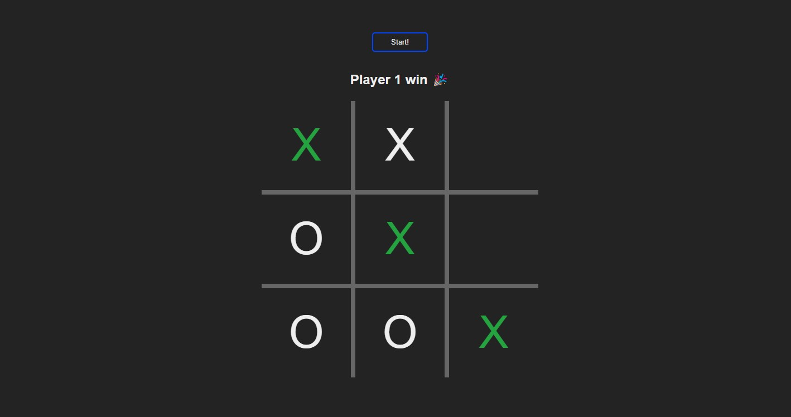

<h1 align="center"> Projeto Jogo da velha </h1>

Projeto realizado para exercitar os conhecimentos básicos de JS, HTML E CSS.

  <a href="#-tecnologias">Tecnologias</a>&nbsp;&nbsp;&nbsp;|&nbsp;&nbsp;&nbsp;
  <a href="#-projeto">Projeto</a>&nbsp;&nbsp;&nbsp;|&nbsp;&nbsp;&nbsp;
  <a href="#memo-licença">Licença</a>

  

 

  

## 🚀 Tecnologias

Esse projeto foi desenvolvido com as seguintes tecnologias:

- HTML e CSS
- JavaScript

## 💻 Projeto

O projeto do jogo da velha é um exercicio, onde foi possível praticar o uso de objetos, function e atualizar elementos HTML via DOM

## :memo: Licença

Esse projeto está sob a licença MIT.

---

Feito com ♥ by Natan Martins dos Santos :wave:
